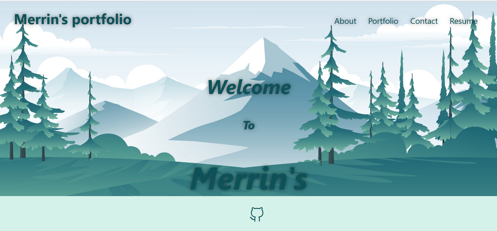

## Merrin's Portfolio

## Description
Hello fellow Coders, my name is Merrin Ajo. I currently reside in Texas. I have an Masters in Business Administration and graduated from Texas Woman's University. I have lived in multiple countries throughout my life and loves to learn and get acclimated to new cultures. I love traveling and have a goal to see one new place every year. I recently became interested in coding after meeting two brilliant coders from India. They mentioned about the flexibility they currently have with their jobs as you get to work from home. Most of us struggled to find a stable career during the Covid 19 pandemic and I felt like going into the Coding space could open up new doors in my life that can lead to a stable career and have the flexibility that I have always dreamed of.


## Website 


## User Story

```md
AS AN employer looking for candidates with experience building single-page applications
I WANT to view a potential employee's deployed React portfolio of work samples
SO THAT I can assess whether they're a good candidate for an open position
```

